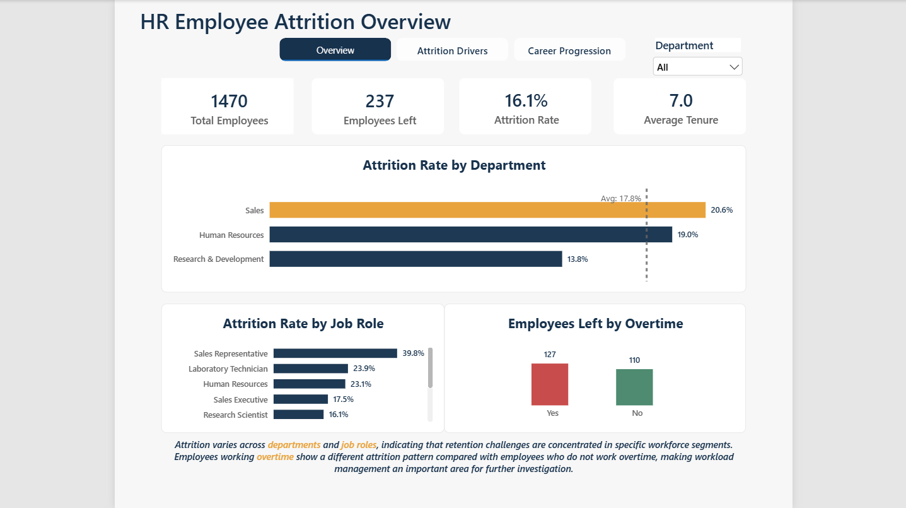
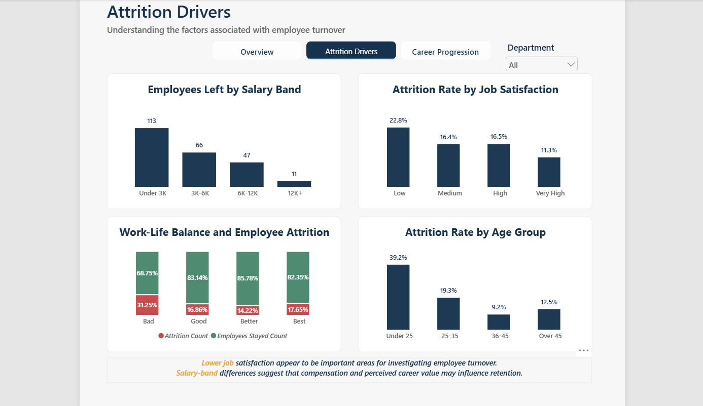
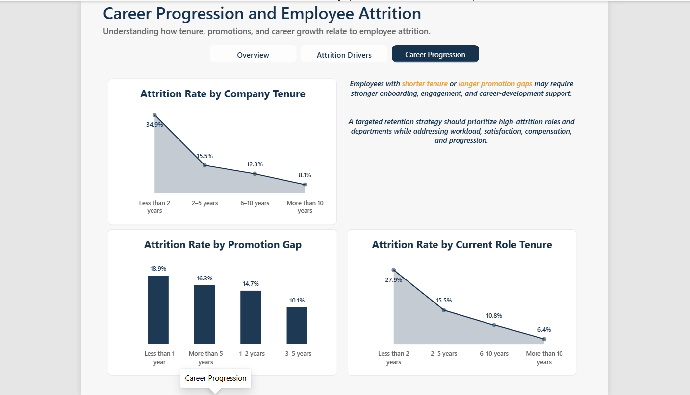

## HR Employee Attrition Analysis

### Project Overview

This project analyzes employee attrition using MySQL and Power BI to understand employee turnover patterns and identify workforce segments that may require further investigation.

The analysis focuses on departments, job roles, salary bands, job satisfaction, work-life balance, age groups, overtime, tenure, and career progression.

The project follows a complete analytics workflow:

SQL data preparation → Exploratory analysis → SQL views → Power BI dashboard → Business insights

### Business Objective

The main objective is to understand:

* How many employees have left the organization.
* Which departments and job roles have higher attrition.
* How salary, job satisfaction, work-life balance, and overtime relate to attrition.
* Whether tenure and promotion gaps show different attrition patterns.
* Which areas may require further employee-retention investigation.

### Tools and Technologies

* MySQL — Database creation, data preparation, SQL analysis, and views
* Power BI — Interactive dashboard and data visualization
* DAX — Dynamic measures and calculated columns
* Excel/CSV — Source data handling

### Project Files

- [Power BI Dashboard](powerbi/HR_Employee_Attrition_Dashboard.pbix)
- [SQL Scripts](sql/)
- [Dataset](data/WA_Fn-UseC_-HR-Employee-Attrition.csv)
- [Dashboard Screenshots](screenshots/)

### Dashboard Pages

1\. HR Employee Attrition Overview

This page provides a high-level summary of:

* Total employees
* Employees who left
* Overall attrition rate
* Average tenure
* Attrition by department
* Attrition by job role
* Employees left by overtime

2\. Attrition Drivers

This page explores attrition patterns across:

* Salary bands
* Job satisfaction
* Work-life balance
* Age groups

3\. Career Progression and Employee Attrition

This page analyzes the relationship between attrition and:

* Company tenure
* Promotion gap
* Current role tenure

### Key Findings

* Overall employee attrition stands at 16.1%, with 237 employees leaving out of 1,470.
* Sales records the highest department-level attrition at 20.6%, followed by Human Resources at 19.0%.
* Research \& Development has the lowest department-level attrition among the three departments at 13.8%.
* Sales Representatives show the highest visible job-role attrition at 39.8%.
* Employees working overtime account for 127 exits, compared with 110 exits among employees not working overtime.
* Attrition patterns vary across salary, satisfaction, work-life balance, age, tenure, and career-progression groups.

### Business Recommendation

A targeted retention strategy should prioritize high-attrition roles and departments while addressing workload, employee satisfaction, compensation, and career progression.

These findings should be used to identify areas for further investigation rather than treating any single factor as the direct cause of employee attrition.

### Project Structure

HR-Employee-Attrition-Analysis/

│

├── README.md

│

├── data/

│   └── README.md

│

├── sql/

│   ├── 01\_database\_setup.sql

│   ├── 02\_analysis\_queries.sql

│   └── 03\_views.sql

│

├── powerbi/

│   └── HR\_Employee\_Attrition\_Dashboard.pbix

│

├── screenshots/

│   ├── overview.png

│   ├── attrition-drivers.png

│   └── career-progression.png

│

### Dashboard Preview

### 1. HR Employee Attrition Overview

### 2. Attrition Drivers

### 3. Career Progression and Employee Attrition

## Conclusion

This project demonstrates the use of SQL and Power BI to transform employee data into interactive dashboards and business-focused insights. The analysis covers attrition patterns across departments, job roles, compensation, satisfaction, work-life balance, tenure, and career progression.

The dashboard provides an interactive way to explore these patterns and identify workforce segments that may benefit from deeper analysis and targeted retention initiatives.

